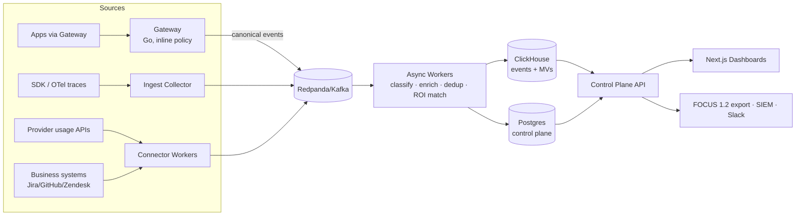

# BadgerIQ AI — Production Architecture

*Companion to `AI_FinOps_Product_Requirements_and_Market_Research.docx`. This document turns the PRD into concrete, defensible engineering decisions, informed by current (mid-2026) industry standards research, and maps each decision to the working code in this repository.*

---

## 1. Architecture at a Glance

The governing principle, taken directly from the PRD and validated against every production AI gateway studied: **the inline path stays thin; everything heavy is asynchronous.** A request through the gateway touches only in-memory structures (key lookup, budget counter, compiled regexes) before being forwarded. Classification beyond deterministic rules, ROI correlation, aggregation, and anomaly detection all happen downstream of the event bus, where they can fail, retry, and scale independently without ever adding latency to a customer's LLM call.

## 2. Standards Decisions (the research-driven part)

Three standards decisions remove enormous amounts of future rework, and all three changed materially in the last twelve months, which is why they were re-verified before this design was committed.

**Canonical billing schema: FOCUS 1.2 with `x_ai_*` extensions.** FOCUS 1.2 went GA with exactly the capabilities this product needs: SaaS/PaaS billing support, pricing in non-monetary units such as tokens and credits with auditable conversion to currency, invoice-level reconciliation, and a sanctioned `x_` custom-column extension mechanism. AWS, Microsoft, Google, and Oracle all ship FOCUS exports, and adoption among large spenders is broad. The PRD's instinct ("FOCUS-style normalized schema") is therefore upgraded to a hard commitment: BadgerIQ's export format *is* FOCUS 1.2, with extension columns `x_ai_agent_id`, `x_ai_run_id`, `x_ai_token_type`, `x_ai_risk_severity`, `x_ai_outcome_id`, and `x_ai_attribution_confidence`. The four-cost-column model (ListCost, ContractedCost, BilledCost, EffectiveCost) maps cleanly onto the price-book engine: list price from the public price book, contracted from tenant-negotiated rates, billed from provider exports, effective after credits. This makes BadgerIQ data ingestible by every FOCUS-aware FinOps suite — integration leverage rather than competition, exactly as the PRD's risk section recommends.

**Telemetry: OpenTelemetry GenAI semantic conventions.** The OTel GenAI conventions now cover LLM client calls, agent orchestration spans (`invoke_agent`, `execute_tool`), MCP tool calling, content capture, and evaluation, and major vendors have begun native support. They remain formally experimental, so the SDK pins a convention version and uses the `gen_ai.*` attribute names (`gen_ai.provider.name`, `gen_ai.request.model`, `gen_ai.usage.input_tokens`, `gen_ai.operation.name`) in its event payloads, with the documented `OTEL_SEMCONV_STABILITY_OPT_IN` dual-emission pattern reserved for the convention-stabilization transition. The practical consequence: customers already instrumented with Langfuse, OpenLLMetry, or vanilla OTel can route existing traces into BadgerIQ's collector with a mapping shim rather than re-instrumenting — which directly serves the PRD's "integrate with existing LLM tracing tools instead of forcing full replacement" strategy.

**Analytics store: ClickHouse with incremental materialized views.** This is now the consensus architecture for exactly this workload. Published production cases run 50M+ daily LLM events on time-partitioned MergeTree tables, and teams that started on Postgres for event analytics report dashboard p95 dropping from seconds to ~12ms after migrating with insert-time materialized views. The schema in `deploy/clickhouse/001_events.sql` applies the proven pattern: partition by month, order by `(tenant_id, ts, ...)` so every query prunes to one tenant before scanning, `LowCardinality` on dimensional columns, `SummingMergeTree` MV targets for the three hot dashboard paths (daily spend by team/model, hourly spend by key for budget burn-down and runaway-loop detection, daily risk rollup), raw events retained on TTL-tiered storage for drill-down and price-change recalculation, and `ReplacingMergeTree` keyed on `(tenant_id, ts, call_id)` to absorb the PRD's cross-source dedup requirement (the same call arriving from gateway logs, SDK traces, and provider exports collapses to one row, with a `source` column preserving provenance).

**Gateway language: Go, custom-built and thin.** The market data is unambiguous: Python proxies hit throughput and latency ceilings at a few hundred RPS and require Postgres/Redis on the hot path, while compiled gateways add microseconds of overhead at thousands of RPS. The PRD's p95 < 75ms policy-check budget is comfortably met by the Go implementation here: the inline path performs zero I/O — key auth, budget check, and DLP precheck are all in-memory, and event emission is a non-blocking channel send to a buffered async flusher. Owning the gateway (rather than wrapping LiteLLM) is also the strategic call the PRD makes: the gateway is the attribution and enforcement point, which is the proprietary asset.

## 3. The Inline Path (implemented in `services/gateway/`)

A request flows through nine deliberate stages, each visible in `proxy.go`: request-ID assignment, virtual-key authentication, model allowlist, budget and rate-limit precheck, deterministic DLP classification with policy decision (allow → log → warn → redact → block, escalating), provider resolution by longest model-prefix match, streaming or buffered proxy with usage capture, cost computation against the effective-dated price book, and asynchronous canonical-event emission. Two details matter for production credibility.

First, **usage capture works for streaming**, which is where most cost-tracking products silently lose data. The gateway injects `stream_options.include_usage` into streamed requests and scans SSE chunks for the final usage object while passing bytes through to the client with per-line flushing, so token accounting is exact even for agent workloads that stream everything. Cached tokens are first-class: cache reads are priced at the cache-read rate and subtracted from billable input, because cache economics are precisely where naive per-token accounting goes wrong (the PRD's §3 point about LLM cost not being simple per-request cost).

Second, **privacy is structural, not configurational**. The canonical `LLMCallEvent` has no field for raw content — only a truncated SHA-256 prompt hash for dedup/cache analytics and categorical DLP findings (class, category, severity, confidence, count). The no-prompt-storage mode the PRD demands is therefore the only mode the event pipeline supports; full-content capture, when a tenant opts in later, becomes a separate encrypted object-storage path with its own retention controls, never mixed into the analytics store.

DLP follows the PRD's phased strategy: deterministic classifiers first (AWS keys, private-key blocks, JWTs, generic API keys, Luhn-validated card numbers, SSNs, emails, IPs), which are fast, explainable, and tunable — the Luhn check exists specifically to suppress the false positives that the PRD's risk section identifies as the adoption killer. ML classification arrives later as an *async enrichment worker*, never inline.

Budgets are enforced pre-flight from in-memory month-to-date counters with realized cost booked post-flight. The MVP store is per-process; the production version swaps in Redis behind the identical `BudgetStore` interface so counters are shared across gateway replicas and survive restarts, with async drain to Postgres for the monthly close workflow. Budget loss tolerance is bounded by design: provider billing reconciliation (the connector pipeline) is the accounting source of truth; gateway counters are the fast control signal.

## 4. Control Plane and Data Model

Postgres (`deploy/postgres/001_core.sql`) owns everything low-volume and consistency-critical, implementing the PRD §9 canonical entities: tenants with retention and content-capture posture, the identity graph (identities, teams, aliases for cross-source mapping), the app and agent registries with approval status and decommission workflow, virtual keys stored as hashes with the secret shown once, policies with scope/condition/action/fail-mode, the versioned effective-dated price book with provenance for audit, allocation rules with priority and percentage splits for chargeback, hierarchical budgets with alert thresholds and a hard-limit flag (showback by default, chargeback when finance is ready), connector state with incremental sync cursors, ROI templates with attribution windows and confidence parameters, and an append-only audit log.

The split of responsibilities is strict: Postgres answers "what is configured and who owns what"; ClickHouse answers "what happened and what did it cost." The ROI engine's headline query — cost per outcome — lives in ClickHouse as `v_unit_economics`, joining agent runs to business outcomes with the attribution-confidence average surfaced alongside the number, because the PRD is right that ROI claims without visible confidence get laughed out of finance reviews.

## 5. SDK and Agent Attribution

The Python SDK (`packages/sdk-python/`) implements the PRD's agent/run/step/outcome model with two integration depths. With the gateway, the SDK only propagates identity: `run.llm_headers()` returns `X-AgentLedger-Agent-Id/Run-Id/Step-Id` headers that the gateway stamps onto every event, so cost rolls up to runs automatically. Without the gateway, `record_llm_call()` reports usage directly. Either way, `record_outcome()` is the differentiating call — it links a run to a business event (ticket resolved, PR merged, invoice processed) with a dollar value, quality score, and attribution confidence, feeding the unit-economics view. The SDK is stdlib-only, fire-and-forget, and guaranteed never to raise into the host application, because telemetry that can break a customer's agent is telemetry that gets ripped out.

## 6. Scaling, Reliability, and Failure Modes

The PRD's 10B events/year target is roughly 320 events/second sustained with bursty agent-loop peaks an order of magnitude higher. The architecture absorbs this in three places. Gateways are stateless (after the Redis budget store lands) and scale horizontally behind a load balancer with regional clusters for the enterprise tier. The event bus (Redpanda chosen over Kafka for operational simplicity at this scale; protocol-identical, swappable) decouples ingestion bursts from ClickHouse insert batching, with dead-letter queues and replay from the object-storage event archive. ClickHouse scales reads through the materialized views — dashboards never touch raw events — and writes through async inserts and monthly partitioning, with the documented ZSTD/tiered-storage pattern keeping 13-month retention affordable.

Failure modes are explicit and per-policy, as the PRD requires. If the control plane is unreachable, the gateway serves from its last-loaded config snapshot. If the event sink backs up, the buffer drops events with a counter rather than blocking requests — acceptable because provider billing reconciliation backstops cost accuracy. DLP fail-mode is configured per tenant: fail-open (default, availability-first) or fail-closed (regulated tenants). The gateway's own availability risk is mitigated the way the PRD prescribes: audit-only mode and direct-to-provider fallback are first-class deployment options, so the gateway is never a forced single point of failure during the sales conversation.

## 7. Security and Compliance Posture

Tenant isolation is enforced at three layers: virtual keys resolve tenancy before any other processing, every ClickHouse table leads its ordering key with `tenant_id`, and every Postgres table carries a tenant foreign key (row-level security policies to be enabled when the API layer lands). Secrets never live in config: provider keys come from environment/secret-manager references, customer connector credentials are vault references (`secret_ref`), and virtual-key secrets are stored only as hashes. The SOC 2 path is front-loaded per the PRD checklist: the audit log, structured JSON logging, and the privacy-by-structure event model are in the foundation rather than retrofitted. The EU AI Act evidence-pack opportunity from the PRD becomes straightforward once the agent registry and risk events exist — it is an export format over data the product already collects.

## 8. What Was Deliberately Not Built Yet

The browser extension and endpoint sensor remain Phase 2/3 exactly as the PRD argues: they multiply procurement friction and engineering surface before the SaaS/gateway wedge has proven value. The ML/NLP classification tier waits until the deterministic tier's precision metrics justify it. Neo4j waits until graph queries outgrow Postgres recursive CTEs. Enterprise single-tenant deployment waits for a design partner who demands it. The Next.js dashboard and control-plane API are the immediate next build (see §9) — they were sequenced after the data plane because every pixel of the dashboard is a query against the materialized views defined here, and getting the event schema right first is what makes the UI a two-week job instead of a re-architecture.

## 9. Build Sequence (next 16 weeks, mapped to PRD §10.1)

Weeks 1–2 harden what exists: Redis-backed budget store, gateway config hot-reload from Postgres, Anthropic-native API translation (Messages API ↔ OpenAI format), and the ingest collector service that validates SDK events against the JSON schema and writes to Redpanda. Weeks 3–5 build the connector framework with the first four importers (OpenAI usage API, Anthropic usage API, Bedrock, Vertex) plus the reconciliation job that diffs gateway-observed cost against provider-billed cost and books adjustments. Weeks 6–9 deliver the control-plane API (TypeScript/NestJS per the PRD's split: Go for the data plane, TS for CRUD velocity) and the Next.js dashboard suite over the materialized views: executive spend, allocation, model mix, budget burn-down, risk events. Weeks 10–12 ship the ROI MVP: GitHub/Jira/Zendesk outcome connectors, the attribution matcher (time-window + identity + branch/issue correlation with confidence scoring), and the ROI template editor. Weeks 13–16 are pilot hardening: SSO/OIDC, SCIM, load testing the gateway to the p95 < 75ms budget at 1k RPS, ClickHouse capacity validation at 50M events/day, FOCUS 1.2 export, and the 30-day pilot report generator that the PRD's go-to-market wedge depends on.

## 10. Repository Map

`services/gateway/` is the working Go gateway — compiled, unit-tested (8 tests covering attribution, cost math, effective-dated pricing, DLP block/redact, Luhn false-positive suppression, budgets, routing), and smoke-tested live end-to-end (`smoke_test.py`). `deploy/clickhouse/` and `deploy/postgres/` hold the full analytics and control-plane schemas. `pricing/pricebook.json` seeds the effective-dated price book (verify rates against provider pricing pages before production use — prices change frequently and the file's `source` field exists for exactly that audit). `packages/sdk-python/` is the tracing SDK, verified against a live collector. `docker-compose.yml` brings up Postgres, ClickHouse, Redpanda, and the gateway for local development.
