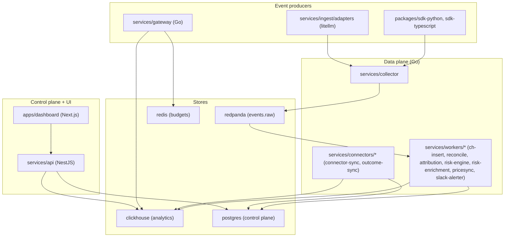

# Architecture diagrams

High-level Mermaid diagrams of the AgentLedger monorepo, one file per project/area.
Each `.mmd` names its **source of truth** in a top `%%` comment and contains only
types, tables, routes, and edges that appear verbatim in that source — nothing is
invented. Every diagram in this folder was validated with a real Mermaid parser
(`@mermaid-js/mermaid-cli`).

These are intentionally coarse: key members only, no styling/colors (so they read
in dark mode), and no per-field dumps. For exact fields, read the cited source file.

## Whole-repo dependency graph

Producers emit events, the Go data plane lands them in the stores, the NestJS API
reads the stores, and the Next.js dashboard reads the API. (Mirror of
[`repo-overview.mmd`](repo-overview.mmd).)

## Index

| Diagram | Type | Scope | Source of truth |
|---|---|---|---|
| [`repo-overview.mmd`](repo-overview.mmd) | flowchart | Whole-repo layer graph | `docker-compose.yml`, `services/api/src/app.module.ts` |
| [`deploy-topology.mmd`](deploy-topology.mmd) | flowchart | Container startup / `depends_on` graph | `docker-compose.yml` |
| [`data-plane-ingest.mmd`](data-plane-ingest.mmd) | flowchart | Event ingestion data flow | `docker-compose.yml` (topic/URL env) |
| [`api-modules.mmd`](api-modules.mmd) | flowchart | NestJS modules + guard pipeline | `services/api/src/app.module.ts` |
| [`postgres-core.mmd`](postgres-core.mmd) | ER | Control-plane schema + FKs | `deploy/postgres/001_core.sql` |
| [`clickhouse-analytics.mmd`](clickhouse-analytics.mmd) | flowchart | Analytics tables, MVs, views | `deploy/clickhouse/001_events.sql`, `005_outcome_graph.sql` |
| [`dashboard-routes.mmd`](dashboard-routes.mmd) | flowchart | Next.js App Router routes | `apps/dashboard/app/**/page.tsx` |

## Suggested reading order for a newcomer

1. **[`repo-overview.mmd`](repo-overview.mmd)** — the layers and how data moves end to end.
2. **[`data-plane-ingest.mmd`](data-plane-ingest.mmd)** — how a single event reaches ClickHouse (`llm_calls`).
3. **[`clickhouse-analytics.mmd`](clickhouse-analytics.mmd)** — how raw events become the dashboard aggregates and the `cost → outcome` views.
4. **[`postgres-core.mmd`](postgres-core.mmd)** — the control-plane entities everything is scoped to (`tenant_id` first).
5. **[`api-modules.mmd`](api-modules.mmd)** — where the API surface lives and the `rate-limit → authenticate → authorize` request pipeline.
6. **[`dashboard-routes.mmd`](dashboard-routes.mmd)** — the CFO/CISO/agent/user views the API feeds.
7. **[`deploy-topology.mmd`](deploy-topology.mmd)** — how the pieces boot together under `docker compose`.

> Convention: dependency arrows point from a consumer to what it depends on
> (dashboard → api → stores). The layout follows the boundary law in
> [`../../CLAUDE.md`](../../CLAUDE.md): the gateway is optional and every store is
> tenant-scoped (`tenant_id` leads every ClickHouse ordering key and every
> Postgres table carries a tenant FK + RLS).
